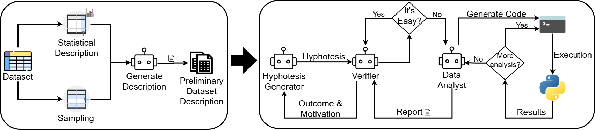
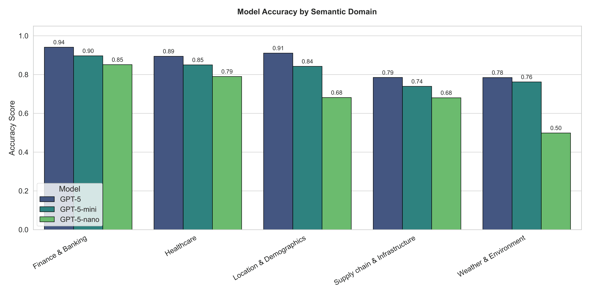
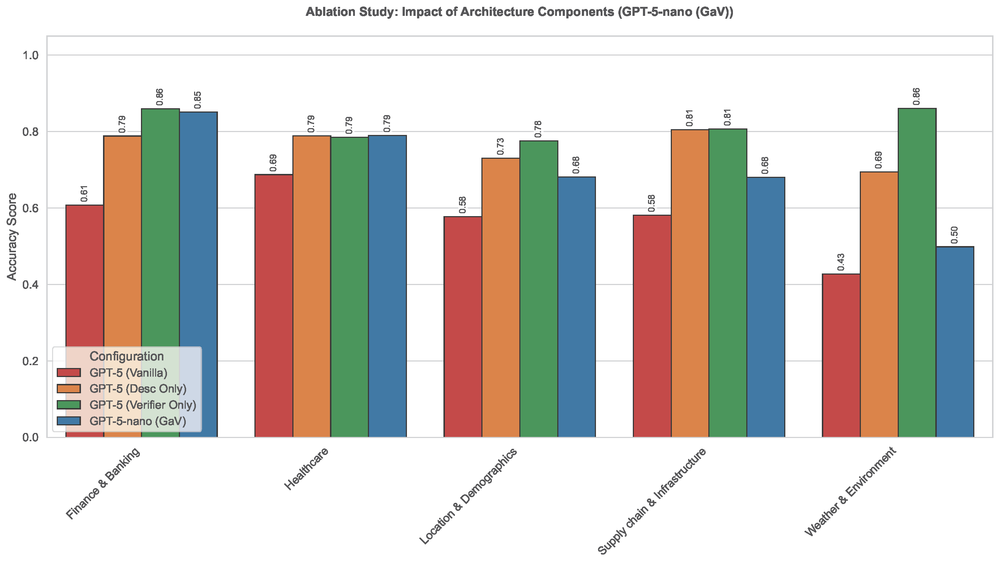

# Aspect-Based Column Understanding

**ABCU (Aspect-Based Column Understanding)** is a benchmark created for the homonymous paper introducing this novel task.  
ABCU focuses on the **semantic interpretation of table attributes**, aiming to uncover what each column represents in the real world and how its values are expressed, aggregated, or related to others, according to specified **semantic aspects**.

---

## 🧩 Overview

Unlike traditional column-type annotation tasks, ABCU provides **fine-grained semantic statements** for each attribute, describing its meaning across multiple conceptual facets.  
All annotations have been **produced and reviewed by human annotators**, ensuring semantic precision and interpretability.

The benchmark allows researchers to evaluate and develop systems capable of generating or verifying human-understandable statements about table attributes — a core step for data understanding and schema-level AI reasoning.

---

## 🏙️ Data Source & Benchmark Composition

To ensure a rigorous evaluation relevant to the **ICDE Industrial Track**, we constructed a composite benchmark spanning two distinct data distributions. This dual-source approach addresses the need for testing both "in-the-wild" dirty data and structured industrial schemas.

### 1. Municipal & Civic Domain (NYC Open Data)
One part of the benchmark is derived from the **NYC Open Data** portal. This subset represents the "Socio-Science" and public administration domain, challenging the model with high ambiguity, messy formatting, and diverse civic topics.

* **Original Portal:** [NYC Open Data](https://opendata.cityofnewyork.us/)
* **Curated Subset (ABCU):** [📂 Download Benchmark Data](https://drive.google.com/drive/folders/1emdGsmkhdfj8Da3ozuYLvMQpDbfgamAD?usp=sharing)

### 2. Industrial & Commercial Domain (Snowflake Source)
To expand domain coverage beyond civic data and test applicability in enterprise environments, we integrated a new subset sourced from **Snowflake Marketplace** and real-world regulatory data.

* **Focus:** Business-critical schemas requiring specific domain knowledge.
* **Key Characteristic:** Unlike flat open data, these datasets introduce complex schema relationships (e.g., 1:N mappings, foreign key validations) that require deep semantic verification.

---

## 📂 Repository Structure

```
Column Meaning Ontology.pdf        # definitions and examples of the 7 aspect types
v2_final_attributes_json.json              # human-annotated benchmark data on NYC Open Data
industrial_benchmark_attributes.json        #human-annotated benchmark data from Snowflake source

semforest+gav_tree.json                #Semantic Tree generated on biodivtab benchmark by the synergy of SemForest (https://github.com/golden-eggs-lab/semforest) and GaV
```

---

## 📘 Aspect Facets

Each attribute is annotated according to one of **seven aspects facets**, each describing a different semantic type:

1. **Entity or Attribute Meaning** – what real-world entity, event, or property the column represents.  
2. **Value Representation** – the syntactic or format conventions of values (e.g., date pattern, measurement unit).  
3. **Value Semantics** – the meaning behind categorical or numeric codes.  
4. **Row Context** – how the attribute value relates to the row’s granularity or entity.  
5. **Aggregation and Derivation** – whether the value is computed or aggregated from others.  
6. **Relational Context** – structural or semantic links between attributes (e.g., foreign keys, dependencies).  
7. **Temporal Scope** – the time instant, duration, or validity period represented by the value.

All facets, along with examples and annotation guidelines, are detailed in `Column Meaning Ontology.pdf`.

---

## 🧾 Annotation Format

The benchmark annotations are stored in the JSON files, `v2_final_attributes_json.json` and `industrial_benchmark_attributes.json`, following this structure:

```json
[
  {
    "dataset_name": "For_Hire_Vehicles__FHV__-_Active_20251003",
    "dataset_description": "This dataset, which includes all TLC licensed for-hire vehicles which are in good standing and able to drive, is updated every day in the evening between 4-7pm. Please check the 'Last Update Date' field to make sure the list has updated successfully. 'Last Update Date' should show either today or yesterday's date, depending on the time of day.",
    "labels": [
      [
        "Active",
        "Value Semantics",
        "Active is a categorical (boolean-like) status flag set by the TLC indicating regulatory operational status: ‘YES’ means the vehicle’s for-hire license is current, in good standing, and the vehicle is authorized to operate; by design this dataset contains only ‘YES’ values (no nulls), and while not present here, a ‘NO’ in other contexts would indicate the vehicle is not currently authorized (e.g., expired, suspended, or otherwise inactive)."
      ],
      ...
      [
        "Active",
        "Temporal Scope",
        "Active is a categorical status flag (here always “YES”) indicating that, at the moment of the dataset snapshot—anchored by the row’s Last Date Updated/Last Time Updated—the vehicle is currently licensed and in good standing to operate; it is not a timestamp or duration but a point-in-time operational status that should be interpreted alongside regulatory dates such as Expiration Date and may change in subsequent daily updates."
      ]]
  }
]
```

Each record includes:
- the dataset name and short description,
- a list of annotation triples (attribute, ontology type, statement).

---

## ✍️ Human Annotation Process

The ground truth for this benchmark was established through a rigorous **manual annotation workflow** performed by domain experts. To ensure high-quality semantic profiles, the process followed a strict protocol based on the guidelines defined in `Column Meaning Ontology.pdf`.

### 🛠️ The Workflow
Annotators did not rely on surface-level observation; instead, they utilized dedicated data analysis tools to inspect the dataset from three perspectives:
1.  **Schema & Metadata Analysis:** Examining table structures, inherent constraints, and available documentation.
2.  **Statistical Profiling:** Analyzing column distributions, frequency patterns, null rates, and data types to infer structural properties.
3.  **Row Sampling:** Manually inspecting representative data samples to understand the context of specific values.

### 📝 Annotation Structure & Standards
Each annotation is formulated as a **verifiable fact** regarding the attribute's semantics, strictly grounded in the actual data. To ensure completeness, every generated fact follows a tripartite structure:
* **Definition:** A clear statement of what the attribute represents.
* **Contextual Meaning:** How the attribute relates to the specific domain or business logic.
* **Statistical Proof:** Empirical evidence (e.g., uniqueness, specific value patterns) that supports the definition.

**Quality Assurance:** All statements underwent a secondary review phase to guarantee **semantic correctness, clarity, and evidence grounding**.

> **⚠️ Special Note: `[PRIOR_KNOWLEDGE]` Markers**
> In specific instances within the **NYC Open Data** subset, you may encounter the tag `[PRIOR_KNOWLEDGE]`.
> * **Purpose:** This marker identifies complex semantic facts that cannot be inferred solely from the data distribution but require **deep, pre-existing domain expertise** (e.g., specific municipal codes or legacy administrative acronyms).
> * **Implication:** These cases represent the "hardest" tier of the benchmark, testing the model's ability to retrieve external knowledge rather than just profiling the data, for a future work.
---

### 🏭 Industrial Subset Statistics (Snowflake Source)

To validate GaV in enterprise scenarios, we analyzed the specific properties of the 20 datasets sourced from the Snowflake Marketplace and regulatory bodies. This subset is designed to test the model against rigorous business schemas and domain-specific terminology.

#### 📈 Key Metrics
| Metric | Value | Interpretation |
| :--- | :--- | :--- |
| **Total Datasets** | 20 | Diverse industrial verticals |
| **Total Annotations** | 212 | Facts over columns annotated by humans for semantic verification |
| **Avg. Description Length** | ~35 words | High semantic density (requires rich explanations) |

#### 🌐 Domain Coverage
The industrial benchmark is not limited to a single vertical but spans critical enterprise sectors:

* **💰 Finance & Banking:** FDIC Branch Locations, SEC Financial Analytics, CFPB Complaints. (4 datasets)
* **🏥 Healthcare & Life Sciences:** COVID-19 Epidemiological Data, Hospital Claims/Remits. (3 datasets)
* **🚚 Supply Chain & Infrastructure:** DOT Transportation Statistics, EIA Energy Attributes, Bureau of Labor Statistics. (6 datasets)
* **📍 Location & Demographics:** FEMA Disaster Areas, OpenCellID, Demographics Data. (5 datasets)
* **☁️ Weather & Environment:** Dutch Weather Data, Global Environmental Attributes. (2 datasets)

#### 🧠 Semantic Aspect Distribution
The annotations are balanced across the ABCU ontology, ensuring the model is tested on multiple dimensions of understanding:

| Semantic Aspect | Share | Description |
| :--- | :--- | :--- |
| **Value Semantics** | **25.2%** | Meaning of specific values (e.g., *"Is 'P' Provisional or Permanent?"*) |
| **Value Representation** | **21.8%** | Data types and formats (e.g., *"Is this date UNIX epoch or ISO-8601?"*) |
| **Entity Meaning** | **17.8%** | Real-world entity mapping (e.g., *"Is this ID for the Bank or the Branch?"*) |
| **Relational Context** | **12.4%** | Foreign keys and functional dependencies |
| **Temporal Scope** | **12.4%** | Time validity and granularity |
| **Aggregation/Derivation** | **10.4%** | Formulas and calculated fields from other attributes |


### 🏛️ Municipal Subset Statistics (NYC Open Data)

The core of our benchmark comprises 26 datasets from the NYC Open Data portal. This subset represents the "Socio-Science" domain and challenges the model with high ambiguity, messy formatting, and the "dirty" reality of public administration data.

#### 📈 Key Metrics
| Metric | Value | Interpretation |
| :--- | :--- | :--- |
| **Total Datasets** | 26 | Wide variety of civic topics |
| **Total Annotations** | 314 | Facts over columns annotated by humans for semantic verification |
| **Avg. Description Length** | **~66 words** | Extremely high verbosity (descriptions often include legal/administrative context) |

#### 🌐 Domain Coverage
The civic benchmark covers the critical infrastructure of a metropolis:
* **🏙️ Urban Planning & Housing:** Building permits, Wi-Fi hotspots, housing development data.
* **🚌 Transportation & Logistics:** Traffic volume counts, subway entrances, taxi zones.
* **🚑 Public Health:** Drug test locations, epidemiological statistics, water quality.
* **👮 Public Safety:** NYPD complaint data, accident reports.
* **🎓 Education & Demographics:** School districts, SAT results, demographic breakdowns.

#### 🧠 Semantic Aspect Distribution
Unlike the industrial subset which focuses on values and types, the civic subset requires strong **Entity Interpretation** (understanding what a "Zone" or "District" effectively means in a city context).

| Semantic Aspect | Share |
| :--- | :--- |
| **Entity Meaning** | **23.9%** |
| **Value Semantics** | **18.8%** |
| **Value Representation** | **17.8%** |
| **Relational Context** | **14.7%** |
| **Temporal Scope** | **13.1%** |
| **Aggregation/Derivation** | **7.3%** |
| **Row Context** | **4.4%** |

---

## 🚀 Architecture & Workflow

The GaV system operates through a multi-agent architecture designed to mimic the reasoning process of a human data engineer. The workflow is divided into two sequential phases.


*(Figure: Overview of the Guess-and-Verification Protocol)*

### Phase 1: Context Initialization
Before reasoning begins, the system builds a foundational context for the dataset, known as the **Preliminary Dataset Description**. This involves:
* **Statistical Profiling:** Computing column-level statistics (distributions, null rates, types).
* **Sampling:** Extracting representative row samples to provide local data context.
* **Zero-Shot Description:** An initial LLM-generated summary of the attribute based on surface features and metadata.

### Phase 2: The Guess-and-Verify Loop
The core reasoning is handled by three specialized agents working in an iterative loop:

1.  **🤖 Hypothesis Generator**
    * **Role:** Formulates candidate semantic statements (the "Guess") for a specific column aspect based on the preliminary context.
    * **Refinement:** If a hypothesis is rejected, it uses the Verifier's feedback to generate a corrected and more robust version.

2.  **⚖️ Verifier Agent**
    * **Role:** Evaluates the validity of each hypothesis. It dynamically assesses the **Verification Complexity**:
        * **Easy Path (Reflection):** For trivial checks (e.g., value ranges), it verifies the hypothesis autonomously against metadata.
        * **Hard Path (Delegation):** For complex claims requiring deep inspection, it formulates a natural language *Investigation Query* for the Data Analyst.

3.  **🕵️ Data Analyst (Code Interpreter)**
    * **Role:** Provides the empirical grounding. It acts as a **ReAct agent** that translates investigation queries into executable **Python/Pandas code**.
    * **Action:** It executes the code on the actual dataset, interprets the execution results, and compiles an evidence-based **Verification Report** back to the Verifier.

This **Generate $\rightarrow$ Verify $\rightarrow$ Refine** loop ensures that every semantic profile produced by GaV is not just plausible, but empirically supported by the underlying data.

---

## 📊 Experimental Results

The table containing the results below of our GaV architecture, concerns only the NYC Open Data benchmark:

| Configuration | Model | Accuracy | Input Tokens | Output Tokens | Time |
|:---|:---|:---:|:---:|:---:|:---:|
| **GaV (Ours)** | gpt-5-nano | 85.3% | 244.2K | 240.1K | 453.2s |
| | gpt-5-mini | 88.6% | 194.9K | 87.4K | 437.4s |
| | gpt-5 | **92.2%** | **142.0K** | 141.8K | 632.2s |
| | qwen3-plus | 86.7% | 186.2K | **15.9K** | **77.5s** |
| | qwen3-max | 90.4% | 144.3K | 21.5K | 148.0s |

Moreover, we evaluated **GaV** on an industrial benchmark of real-world datasets from Snowflake source and the civic domain benchmark of NYC Open Data source, and from  comparing different LLM backbones and architectural configurations. The table below reports the average performance metrics extracted from our experiments.

### 🤖 GPT Family Performance

| Configuration | Model | Accuracy | Input Tokens | Output Tokens | Time |
|:---|:---|:---:|:---:|:---:|:---:|
| **Vanilla** (Direct Prompt) | gpt-5 | 62.1% | 32k | 9k | 42s |
| | gpt-5-mini | 58.4% | 32k | 5k | 16s |
| | gpt-5-nano | 55.2% | 32k | 12k | 22s |
| **Description Only** (No Verifier) | gpt-5 | 77.3% | 85k | 39k | 167s |
| | gpt-5-mini | 75.4% | 92k | 24k | 67s |
| | gpt-5-nano | 67.0% | 90k | 51k | 78s |
| **Verifier Only** (No Description) | gpt-5 | 81.5% | 117k | 135k | 583s |
| | gpt-5-mini | 77.0% | 140k | 74k | 305s |
| | gpt-5-nano | 67.9% | 132k | 176k | 415s |
| **GaV (Ours)** | **gpt-5** | **88.2%** | **178k** | **163k** | **508s** |
| | **gpt-5-mini** | **84.1%** | **202k** | **95k** | **305s** |
| | **gpt-5-nano** | **78.6%** | **201k** | **221k** | **399s** |

### 🧠 Qwen Family Performance

| Configuration | Model | Accuracy | Input Tokens | Output Tokens | Time |
|:---|:---|:---:|:---:|:---:|:---:|
| **Vanilla** (Direct Prompt) | qwen-plus | 53.4% | 36k | 2k | 5s |
| | qwen-plus (thinking) | 59.3% | 36k | 13k | 51s |
| | qwen3-max | 57.1% | 36k | 1k | 7s |
| **Description Only** (No Verifier) | qwen-plus | 63.2% | 69k | 3k | 20s |
| | qwen-plus (thinking) | 71.0% | 80k | 40k | 173s |
| | qwen3-max | 67.8% | 67k | 3k | 34s |
| **Verifier Only** (No Description) | qwen-plus | 65.0% | 135k | 34k | 101s |
| | qwen-plus (thinking) | 78.9% | 130k | 183k | 531s |
| | qwen3-max | 77.6% | 122k | 25k | 151s |
| **GaV (Ours)** | **qwen-plus** | **76.0%** | **168k** | **36k** | **126s** |
| | **qwen-plus (thinking)**| **83.3%** | **169k** | **186k** | **480s** |
| | **qwen3-max** | **81.0%** | **153k** | **26k** | **209s** |

> **Note:** Metrics are averaged across the benchmark datasets. Time represents the end-to-end processing duration per dataset.

### 📝 Deep Dive & Key Findings

Our ablation study reveals critical insights into the interplay between Large Language Model reasoning capabilities. By isolating the **Description** and **Verification** components, we observed four distinct behavioral patterns:

#### 1. The Limitations of Direct Reasoning (Vanilla Baseline)
* **Configuration:** *No Description, No Verifier (Direct Prompting)*
* **Observation:** This baseline relies purely on semantic inference from column names and headers. While it is the most efficient in terms of resources (fastest time, lowest token usage), it yields the lowest accuracy (**~62.1%** with GPT-5).
* **Technical Insight:** The massive gap in accuracy compared to GaV (**between -22% and -26%**) demonstrates that LLMs cannot reliably infer column semantics without grounding in actual data statistics. The lack of a feedback loop results in "semantic hallucinations," where the model confidentially asserts incorrect meanings based on superficial naming patterns.

#### 2. The Hallucination Problem (Description Only)
* **Configuration:** *Description ON, Verifier OFF*
* **Observation:** Injecting statistical summaries (distributions, min/max values) significantly improves accuracy (**77.3%** with GPT-5) compared to the baseline.
* **Technical Insight:** While the "Description" component provides necessary context, the absence of an execution-based verifier means the system cannot confirm its intuitions. The model creates a coherent narrative around the data but lacks the mechanism to perform **empirical validation**, leading to errors in ambiguous cases (e.g., distinguishing between *Created Date* vs *Updated Date* without checking value monotonicity).

#### 3. The Cost of "Cold-Start" Verification (Verifier Only)
* **Configuration:** *Description OFF, Verifier ON*
* **Observation:** This configuration provides a massive accuracy boost (**81.5%** with GPT-5) but at the highest computational cost in terms of time (**583s** with GPT-5) and output tokens (**135k** with GPT-5).
* **Technical Insight:** Without a preliminary description, the Verifier operates in a "Cold-Start" mode. The initial hypotheses are often weak or generic. Our log analysis reveals that this forces the **Data Analyst** agent into multiple costly **Refinement Loops**: the Verifier rejects the initial guess, requests new code execution, and iterates. This "trial-and-error" process explains the high output token consumption and extended execution time.

#### 4. The "Warm-Start" Synergy (Ours - Full Architecture)
* **Configuration:** *Description ON, Verifier ON*
* **Observation:** Activating both components achieves the state-of-the-art accuracy (**88.2%** with GPT-5) while actually *reducing* execution time compared to the "Verifier Only" setup (~509s vs 583s for GPT-5).
* **Technical Insight:** This result highlights a critical efficiency trade-off. Although the Description component increases the input context overhead (**~178k input tokens** with GPT-5), it acts as a **"Warm-Start" mechanism**. It primes the Generator with a high-quality context, leading to a much stronger initial hypothesis. Consequently, the Verifier accepts the hypothesis with significantly fewer refinement steps and fewer calls to the Data Analyst code interpreter. The initial investment in input tokens pays off by preventing expensive iterative corrections.

### Performance per Domain


*(Figure: GaV performance per dataset domain)*

### 💡 Conclusion: Architectural Robustness
The full GaV architecture offers the optimal balance between precision and computational overhead.

Crucially, this architectural robustness **democratizes high-end performance**. As shown in the results, the medium-sized **GPT-5-mini** model using GaV achieves **84.1% accuracy**, outperforming the larger GPT-5 model in the "Description Only" (77.3%) and "Vanilla" (62.1%) configurations. This proves that a well-designed **Agentic Workflow** (Generate $\rightarrow$ Verify $\rightarrow$ Refine) can compensate for the lower raw reasoning capabilities of smaller, more cost-effective models.




---

### 🔎 Qualitative Analysis: A Real-World Example

To illustrate the specific contribution of each component, we present a comparison on the **FDIC Branch Locations** dataset.

#### 📍 Context & Challenge
* **Domain:** Financial Regulation (US Banking).
* **Dataset Structure:** A "wide-format" index of **Branches** (physical offices). The FDIC monitors institutions at three levels: (1) **Holding Company** $\to$ (2) **Institution** (Bank) $\to$ (3) **Branch**.
* **Target Column:** `FDIC_INSTITUTION_CERTIFICATE_NUMBER`
* **The Challenge:** The table represents *Branches*, but this column identifies the *Institution*. A naive model sees "ID/Number" and often mistakes it for the Branch's unique ID (Primary Key). The core difficulty lies in recognizing that this is a **grouping key** (Foreign Key) that repeats for every branch of the same bank.

**Ground Truth (Fact):** A unique certification identifier assigned by the FDIC. Verified to map 1:1 to `FDIC_INSTITUTION_ID`, serving as an alternative unique key for the **Institution** entity.

| Configuration | Prediction / Insight | Analysis of the Result |
| :--- | :--- | :--- |
| **Vanilla**<br>*(LLM Only)* | *"A unique numeric identifier assigned to each row. It serves as the Primary Key for the branch records."* | ❌ **Semantic Hallucination.** The model relies solely on the column name ("Number/ID"). It blindly assumes it is a unique key for the table, failing to recognize the granular difference between an *Institution* ID and a *Branch* ID. |
| **Description Only**<br>*(Summary Stats)* | *"A numeric code representing the FDIC certificate of the institution. It is likely an attribute of the bank associated with the location."* | ⚠️ **Incomplete Semantics.** The model correctly identifies the *topic* (it knows it's a Bank Certificate, not a random number), thanks to the context. However, it fails to define its **structural role**. It misses the functional dependency (that it groups branches) and does not detect the 1:1 mapping with the Institution ID, treating it as just "another attribute" rather than a critical Entity Key. |
| **Verifier Only**<br>*(Code Execution)* | *"Data Analysis: Values are NOT unique. There are 78,324 rows but only 4,345 distinct values. The column cannot be used as a Primary Key."* | ⚠️ **Context-Free.** The agent correctly executes code to find duplicates, but interprets this as a negative result ("Not a Key"). Without the semantic "warm-start," it misses that the duplicates are a feature (grouping key) rather than a bug. |
| **GaV (Ours)**<br>*(Full Architecture)* | *"**Institution-level identifier.** It functions as the Institution Key, identifying the chartered bank that owns the branch.<br><br>**Observed behavior:**<br>• Many branches share the same certificate (4,345 certs vs 78,324 branches), consistent with an institution-level key.<br>• **Maps 1:1 to `FDIC_INSTITUTION_ID`** and `INSTITUTION_NAME`.<br>• Use to group/aggregate branch rows by institution."* | ✅ **Perfect Understanding.** GaV combines the semantic hint ("Certificate" $\approx$ Bank License) with deep data verification. It explicitly discovers the **1:1 mapping** with the Institution ID, correctly classifying it as a Foreign Key for the institution entity. |

---

## 🧠 Architectural Insights & Hyperparameter Analysis

Following the feedback from the ICDE review process, we provide an extended analysis of specific architectural behaviors, hyperparameter sensitivity, and the ablation of the verification components.

### 1. Sensitivity of Verification Rounds (`max_steps`)
A key hyperparameter in GaV is the maximum number of refinement rounds allowed for the Verifier agent. Our log deep analysis reveals that this is not a static parameter but depends heavily on **Model Personality** and **Context Quality**.

* **Model Sensitivity (Skepticism Level):** We observed distinct behavioral patterns across model families. **GPT-5** tends to be more decisive, maintaining a relatively low rejection rate of **7.1%**. In contrast, **Qwen-Plus-Thinking** exhibits significantly higher "skepticism," with a rejection rate of **23.9%**. This indicates that specific "reasoner" models are more prone to challenging hypotheses, requiring a higher `max_steps` setting to allow for rigorous iterative verification.

* **Role of Description (The "Warm-Start"):** The *Description* component is critical for efficient convergence. When disabled, the Verifier is forced to reject generic guesses much more frequently. This effect is particularly visible not only in GPT-5 from **7.1%** (with description) to **10%** (without description) but especially in skeptical models. For Qwen-Plus-Thinking, the rejection rate from **23.9%** (with description) to **30.7%** (without description), confirming that the "warm-start" context dramatically reduces the need for costly refinement loops.

> **Guideline:** This parameter should be tuned based on the backbone. Increase `max_steps` for skeptical models or when operating in "Blind Mode" (no description).

### 2. The "Easy" vs. "Hard" Classification Dilemma
The Verifier agent autonomously decides whether a verification task is "Easy" (solvable via metadata/reflection) or "Hard" (requires Python code execution).

* **Behavior of Non-Reasoner Models:** Models like `qwen-plus` (without thinking mode) tend to **underestimate complexity**. They frequently classify ambiguous tasks as "Easy," bypassing the Data Analyst to save tokens. While this reduces cost, it leads to superficial verification and lower accuracy. Indeed, it was observed that non-reasoning models from Qwen family have a higher ratio of **15%** of easy classifications.
* **Valid "Easy" Cases:** The "Easy" path is legitimate only when the hypothesis is trivial or directly verifiable against the statistical summary provided by the Description component (e.g., checking value ranges or null counts).

### 3. Ablation: Why "Reflection" is Not Enough

We investigated the necessity of the **Data Analyst** (Code Execution) by comparing the full GaV pipeline against a "Reflection-Only" baseline (LLM self-correction without tools).

* **Reflection (Verifier without Tools):** Our ablation study shows that self-reflection offers a **slight performance improvement** over the "Description Only" baseline. By revisiting its own logic, the LLM can smooth out internal inconsistencies and refine ambiguous descriptions. However, this approach hits a "verification ceiling": an LLM cannot purely "think" its way to the truth about a dataset's actual distribution or hidden constraints without inspecting the data.

* **Execution (Verifier with Data Analyst):** The full GaV system leverages the Data Analyst to **empirically validate** hypotheses through code (e.g., *"Is this truly a Foreign Key?"*, *"Do these dates strictly follow a sequence?"*).
    * **Result:** While Reflection improves the *plausibility* of the semantic profile, only the Data Analyst ensures its *veracity*. The full architecture (with code execution) consistently outperforms the Reflection-Only mode in complex semantic tasks, demonstrating that semantic reasoning must be grounded in actual data execution to be fully reliable.

#### Table: Impact of GaV Verification on Complex Semantic Aspects

| Model Family | Semantic Aspect | Baseline Accuracy (Reflection) | GaV Accuracy (Execution) | Improvement |
| :--- | :--- | :--- | :--- | :--- |
| **GPT-5** | Entity or Attribute Meaning | 76.5% | **89.7%** | **+13.2%** |
| **GPT-5** | Value Semantics | 90.7% | **93.1%** | **+2.5%** |
| **GPT-5 Mini** | Entity or Attribute Meaning | 75.6% | **76.7%** | **+1.1%** |
| **GPT-5 Mini** | Value Semantics | 78.3% | **91.0%** | **+12.7%** |
| **GPT-5 Nano** | Entity or Attribute Meaning | 68.4% | **76.0%** | **+7.6%** |
| **GPT-5 Nano** | Value Semantics | 78.3% | **84.4%** | **+6.1%** |

---

## Verifier testing with TabFact benchmark

Since verification is the core component of GaV, we separately evaluated the Verifier + Data Analyst subsystem on TabFact to test its ability to distinguish true from false table statements. Remarkably, the GaV Verification subsystem (using gpt-5-nano) achieved an accuracy of 92.8%, outperforming all existing state-of-the-art models, including DeBERTaV3 and PASTA, and even surpassing the human performance (92.1%) as shown in the table over TabFact GitHub https://github.com/wenhuchen/Table-Fact-Checking. This result confirms the high reliability and generality of the verification mechanism.

---

## 🎯 Intended Use

ABCU is designed to evaluate **neuro-symbolic** and **agentic** systems focused on deep tabular interpretation. Unlike traditional classification benchmarks, it targets systems capable of:

* **Automated Semantic Profiling:** Moving beyond simple type detection (CSTD) to generate rich, verifiable semantic descriptions.
* **Evidence-Based Reasoning:** Testing LLM architectures on their ability to ground hypotheses in empirical data (e.g., via the *Guess-and-Verify* paradigm).
* **Neuro-Symbolic Execution:** Evaluating agents that combine language models with code execution tools (Data Analysts) to validate claims.

It explicitly supports research in:
* **Table Understanding & Data Integration:** Disambiguating complex schemas for automated data cataloging.
* **Explainable Data Analytics:** Producing transparent, evidence-backed insights for industrial data lakes.


