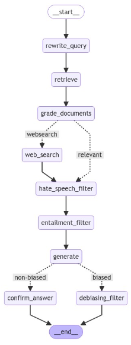

This project represents my Master's Thesis work: **"Integrating Trustworthiness and Fairness Properties in a Multi-Aspect Agent-Based Retrieval-Augmented Generation System"**.

The research addresses the critical limitations of standard RAG systems—specifically hallucination and bias—by proposing a novel **Agentic Architecture**. Instead of a linear retrieve-then-generate process, the system employs a multi-agent orchestration where specialized components collaborate to validate and refine information.

### Methodology & Workflow

The core innovation lies in the **Multi-Aspect Agent-Based** approach. The system is decomposed into distinct agents, each responsible for a specific dimension of the pipeline:

1.  **Orchestrator Agent:** Manages the user query and delegates sub-tasks.
2.  **Retrieval Agent:** Fetches relevant documents from the knowledge base.
3.  **Assessment Agents (Trust & Fairness):** These critical modules evaluate the retrieved context and generated drafts against specific metrics (e.g., factuality, non-toxicity, fairness) *before* the final response is delivered.

### Process Flow

The workflow follows an iterative refinement loop. As shown in the diagram below, the system does not simply output the first generation. Instead, it engages in a **Reasoning Loop**:
* **Step 1:** Query Analysis and Decomposition.
* **Step 2:** Multi-source Retrieval.
* **Step 3:** **Trustworthiness Check**: Verifying source credibility and content factuality.
* **Step 4:** **Fairness Evaluation**: Detecting potential biases in the generated answer.
* **Step 5:** Response Synthesis or Regeneration (if checks fail).

### Key Results
The experimental results demonstrated that integrating these active monitoring agents significantly increases the reliability of the system compared to naive RAG implementations, ensuring that the final output aligns with defined ethical and factual standards.